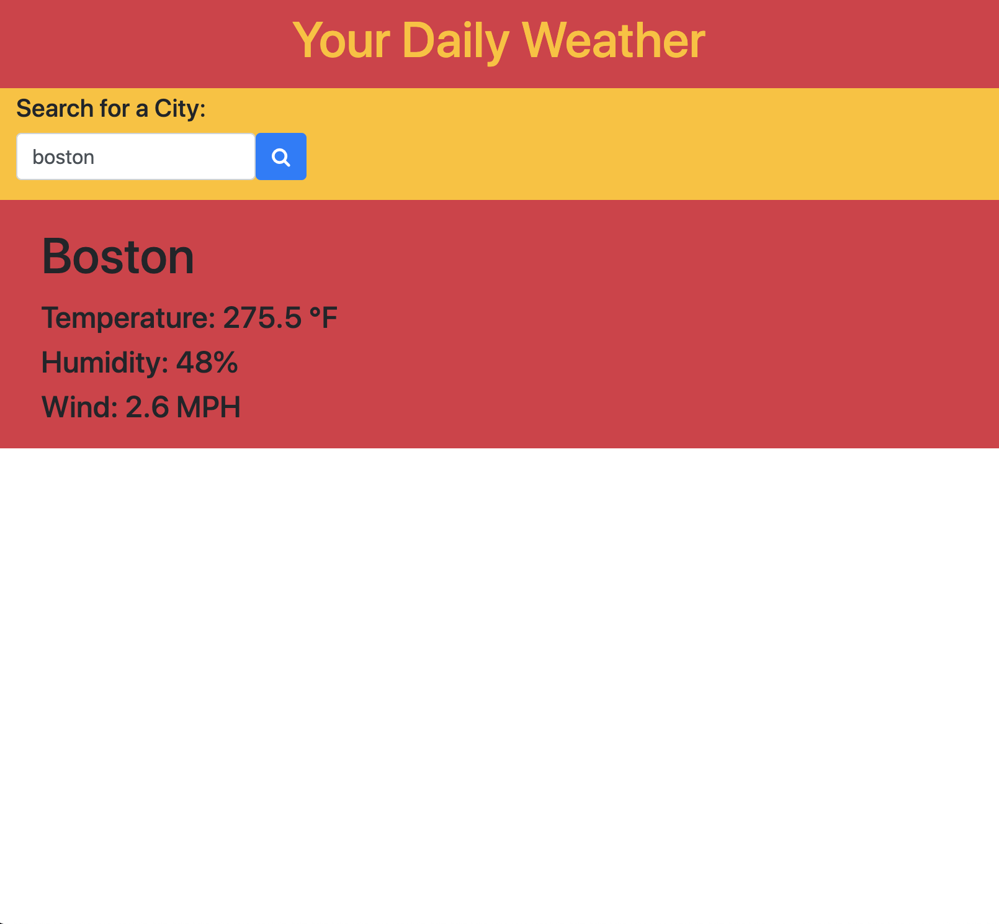

# Weather-Dashboard
The purpose of this application is to show the current weather for a user searched location. Past searches will be saved for future use above the currently searched weather card. The acceptance criteria for this application is the following:
GIVEN a weather dashboard with form inputs
WHEN I search for a city
THEN I am presented with current and future conditions for that city and that city is added to the search history
WHEN I view current weather conditions for that city
THEN I am presented with the city name, the date, an icon representation of weather conditions, the temperature, the humidity, the wind speed, and the UV index
WHEN I view the UV index
THEN I am presented with a color that indicates whether the conditions are favorable, moderate, or severe
WHEN I view future weather conditions for that city
THEN I am presented with a 5-day forecast that displays the date, an icon representation of weather conditions, the temperature, and the humidity
WHEN I click on a city in the search history
THEN I am again presented with current and future conditions for that city
WHEN I open the weather dashboard
THEN I am presented with the last searched city forecast.
While this application does not meet all of the above criteria, the daily weather is still accessible. This application can be found at the following link: https://dlabins.github.io/Weather-Dashboard/.

